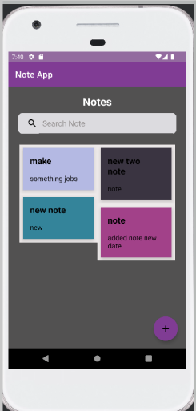
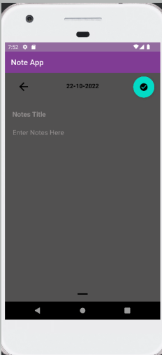
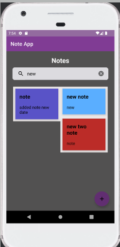

# NoteApp

## Screen Shots :

## Architecture Pattern :
- MVVM (Model View ViewModel) architecture :
  

## Used Tech :
- Kotlin
- MVVM
- Room
- LiveData
- ViewBinding
- Navigation Components
- Coroutine

